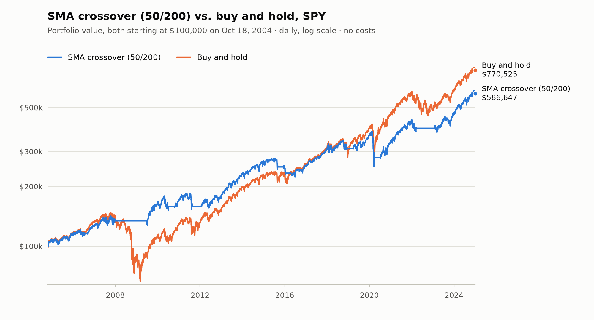

# algo-backtester

A daily backtester in Python, used to test a 50/200-day moving-average crossover against buy-and-hold on SPY from 2004 to 2024.

[](https://github.com/yanbmia/algo-backtester/actions/workflows/ci.yml)

## Headline result

Before costs, the crossover **trailed buy-and-hold on return** (9.2% vs. 10.6% a year) and **took noticeably less risk** (13.5% vs. 19.0% volatility, a -33.7% vs. -55.2% worst drawdown).



| | SMA crossover (50/200) | Buy and hold |
| --- | ---: | ---: |
| Total return | 486.6% | 670.5% |
| CAGR | 9.2% | 10.6% |
| Annualized volatility | 13.5% | 19.0% |
| Sharpe ratio (rf = 0%) | 0.72 | 0.63 |
| Max drawdown | -33.7% | -55.2% |
| Exposure (share of days invested) | 79.1% | 100.0% |

**Comparison window: 2004-10-18 to 2024-12-31** (5,085 daily returns, about 20.2 years), both starting from $100,000, zero costs, next-open fills. The data starts on 2004-01-02, but the window starts on the crossover's first decision date (its 200-day average needs 200 bars of history), so buy-and-hold isn't credited with returns earned while the crossover was still warming up.

Source: [`reports/sma_spy_comparison.csv`](reports/sma_spy_comparison.csv), rounded.

## Why this project

Backtests are easy to get subtly wrong, and almost every mistake (using a price before it was knowable, trading at the same close that produced the signal, comparing strategies over different windows) makes results look better, not worse. None of them raise an error; they just produce a nicer number. This project puts correctness first: the engine is built so those mistakes are structurally hard to make, the tests try to catch them anyway, and the headline result is reported as it came out.

## Approach

```text
cached data  →  point-in-time view  →  strategy  →  next-open execution  →  metrics
```

| Stage | Where | What it does |
| --- | --- | --- |
| Cached data | `data/loader.py`, `data/market_data.py` | Downloads daily OHLCV from yfinance once, caches it as Parquet with a metadata file, and validates every bar (fails loudly, never repairs). |
| Point-in-time view | `data/view.py` | At each close *t*, the strategy receives a `MarketView` that contains only bars dated at or before *t*. |
| Strategy | `strategies/` | Returns target portfolio weights, e.g. `{"SPY": 1.0}`. |
| Next-open execution | `engine/` | Holds the decision overnight, sizes and fills it at the next bar's open through a cost model, and marks the portfolio to market at each close. |
| Metrics | `metrics.py` | Pure functions of the equity and return series, with comparisons computed over a shared window. |

**Timing convention:** decide after the close of day *t* using bars through *t*; fill at the open of day *t*+1.

## Strategy

`SMACrossover` ([`src/backtester/strategies/sma_crossover.py`](src/backtester/strategies/sma_crossover.py)) is a long/flat rule on one symbol. After each close it compares the average of the last 50 closes with the average of the last 200:

- 50-day average above the 200-day average: target weight 1.0 (fully invested)
- otherwise: target weight 0.0 (all cash)

**The parameters were chosen a priori.** 50/200 is the conventional "golden cross" pair. It was fixed in [`configs/sma_spy.yaml`](configs/sma_spy.yaml) before the backtest was run and was not tuned on this sample.

**Ties go flat.** If the two averages are exactly equal, "fast above slow" is false, so the target is 0.0, including the day after being long. The rule is stateless (it never looks at its previous decision), and the averages are computed with `math.fsum` and compared exactly, with no tolerance. An exact tie on real prices is vanishingly rare; the rule exists so the behavior is defined and tested (`test_ties_are_flat_including_right_after_being_long` in [`tests/test_strategies.py`](tests/test_strategies.py)).

The benchmark, `BuyAndHold`, runs through the same engine with the same execution and cost settings. It targets 1.0 from its first decision and buys once.

## Results and interpretation

**Buy-and-hold won on return.** Over the comparison window, $100,000 grew to $770,525 with buy-and-hold and to $586,647 with the crossover: 670.5% vs. 486.6% in total, or a CAGR of 10.6% vs. 9.2%. The crossover gave up about 1.5 percentage points of return a year.

**The crossover took less risk.** Its annualized volatility was 13.5% against 19.0%, and its worst drawdown was -33.7% against -55.2%. It was invested on 79.1% of days and in cash on the other 20.9%. Its Sharpe ratio is higher (0.72 vs. 0.63), but no significance test was run, and a 0.09 difference from one 20-year path of one asset is not evidence of an edge.

**Where the drawdowns came from** ([drawdown chart](reports/figures/sma_spy_drawdown.png)). Buy-and-hold's worst stretch was the 2007 to 2009 bear market (peak 2007-10-09, trough 2009-03-09, about 17 months). The crossover's worst was the 2020 crash (peak 2020-02-19, trough 2020-03-23, about five weeks), which means it came through 2007 to 2009 with a loss smaller than 33.7%. That is the trade a trend filter makes: a decline that lasts over a year gives the 50- and 200-day averages time to cross, while a five-week crash is largely over before they can.

**When it was in the market** ([positions chart](reports/figures/sma_spy_positions.png)). The shaded bands mark when the crossover held SPY (19 fills in all). The 20.9% of days in cash is the whole trade-off: it is why the drawdowns are shallower and also why the return is lower. Cash earns nothing in this backtest, and a crossover only re-enters after a recovery is already under way.

**Reading it plainly:** on SPY over this period, the 50/200 crossover did not beat buy-and-hold. It traded about 1.5 points of annual return for a smoother ride, and that is before costs, which would widen the gap (see [Scope and limitations](#scope-and-limitations)). It is a transparent baseline, not a trading edge.

The window alignment doesn't flatter the crossover. Measured from its own first day (2004-01-02), buy-and-hold's CAGR is 10.3% ([`reports/sma_spy_standalone.csv`](reports/sma_spy_standalone.csv)); over the aligned window it is 10.6%.

## Rigor: preventing lookahead bias

Strategies never see the dataset: at each close *t* the engine calls `MarketData.view(t)`, and the `MarketView` it passes to the strategy returns only bars dated at or before *t*, as read-only copies, through methods that don't accept a date. That boundary is computed in exactly one place, `MarketData._visible_rows` (`searchsorted(cutoff, side="right")`), so an off-by-one has one place to live and one place to test. Separately, the engine holds each decision overnight and fills it at the next bar's open, so even a correctly truncated signal can never trade at the close it was computed from.

That structure makes leaks hard to write by accident. The tests check from the outside that none got through (all in [`tests/test_lookahead.py`](tests/test_lookahead.py) unless noted):

- **Future perturbation.** `TestFuturePerturbation::test_nothing_at_or_before_the_cutoff_depends_on_the_future` rewrites every bar after a cutoff *T* with an unrelated random walk, reruns the full engine, and requires decisions, equity, cash, positions, and fills through *T* to be bit-for-bit identical. It covers 5 strategies × 3 cutoffs × 2 datasets, one of them with symbols that list and delist mid-run. `test_perturbation_shows_up_on_the_very_next_bar` checks the other side: the probe strategy's output does change at *T*+1, so passing can't be explained by insensitivity.
- **Negative control.** `LeakyMarketData` ([`tests/lookahead_harness.py`](tests/lookahead_harness.py)) reproduces the classic off-by-one: each view shows one extra bar while still reporting the correct date. The same check must fail against it (`TestNegativeControl::test_perturbation_check_fails_against_a_leaky_view`), and the first changed decision must move from *T*+1 to *T* (`test_leak_changes_the_decision_at_the_cutoff_itself`).
- **Boundary checks.** `TestBoundary::test_probe_sees_exactly_up_to_now_at_every_step` confirms that at every step of a run the latest bar the probe saw is dated exactly `view.now`, and `test_boundary_check_fails_against_a_leaky_view` is its own negative control.
- **Execution timing.** `TestTiming::test_a_decision_at_t_fills_at_the_next_open_never_the_close` in [`tests/test_backtester.py`](tests/test_backtester.py) uses synthetic bars whose open is always 500 above the close, so a decision on day *t* visibly fills at day *t*+1's open and never at day *t*'s close.

The full write-up, including what these tests cannot catch, is in [`docs/methodology.md`](docs/methodology.md).

## Scope and limitations

v1 establishes a tested, lookahead-safe engine and a transparent baseline. It does not claim a tradable edge. Each limitation names the interface where the extension goes.

- **Gross of costs.** A `CostModel` interface exists in `engine/execution.py`; v1 passes `NextOpenExecution(ZeroCost())` explicitly (`Backtester` has no default execution model, and the config accepts only `costs: zero`). For scale: the crossover made **19 fills** in the comparison window, each moving the whole portfolio into or out of SPY. At 5 bps per side that's roughly 19 × 0.05% ≈ 0.95% of cumulative drag, or about 0.05 percentage points of CAGR. Buy-and-hold pays it once (1 fill in the standalone table). That is small next to the 1.5-point gap, and it widens the gap rather than closing it. One catch for whoever adds costs: v1 sizes orders before costs, so a non-zero cost model with a 100% target overdraws the account and the engine stops with `EngineError` (`test_a_cost_that_overdraws_a_fully_invested_account_is_an_error`). Cost-aware sizing belongs in `Portfolio.orders_for`.
- **Fills at the open, with no slippage or market impact.** Fill rules sit behind the `ExecutionModel` protocol (`reference_prices`, `execute`) in `engine/execution.py`.
- **Single ticker.** `MarketData` is already keyed by (date, symbol), `Portfolio` holds a dict of positions, and strategies return a dict of weights. The engine and the lookahead tests already run on multi-symbol synthetic data with staggered listings.
- **Long/flat, unlevered.** `weight_problems` in `engine/portfolio.py` requires every weight to be in [0, 1] and the total to be at most 1.
- **One strategy with fixed parameters, one in-sample period, no out-of-sample test**, so no predictive claim. `Backtester.run(start, end)` already takes a window, and `Strategy.fit(view)` receives a point-in-time view.
- **No significance testing.** The Sharpe difference (0.72 vs. 0.63) is untested. `metrics.py` has no engine dependencies, and its metrics are pure functions of return and equity series, so a bootstrap would sit beside them.
- **Cash earns 0%, and Sharpe uses rf = 0%.** Idle cash would earn a T-bill rate in practice, so the crossover's return while flat is understated. `metrics.sharpe` takes `rf_annual`; v1 passes 0.0.
- **Fractional shares**, so target weights are hit exactly. Order sizing lives in `Portfolio.orders_for`.
- **Data source.** yfinance is an unofficial Yahoo Finance client. Prices are split- and dividend-adjusted (`auto_adjust=True`), and adjusted history is recomputed after every new dividend or split, so the same date range can come back slightly different on a later download. That is why the range is pinned in `configs/sma_spy.yaml`, the loader reuses its Parquet cache instead of re-downloading (and replaces the file rather than merging when a range is extended), and every cache has a metadata file with its download time and SHA-256. [`reports/sma_spy_run.json`](reports/sma_spy_run.json) records the exact cache behind these results (downloaded 2026-09-27, SHA-256 `33c2c544…`). The cache itself is gitignored, so a fresh clone downloads its own copy; compare its hash with the manifest to know whether you're on identical data. Loaders implement the `DataLoader` protocol in `data/loader.py`. SPY, as an index ETF, also avoids the survivorship question a hand-picked stock would raise.

## Roadmap

v1 is complete. The items below are not planned work; they are what the design leaves room for, and each one is an addition at an existing extension point rather than a rewrite.

| Designed for | Extension point | Already in place |
| --- | --- | --- |
| Transaction costs and slippage | New `CostModel` or `ExecutionModel` classes in `engine/execution.py`, plus cost-aware sizing in `Portfolio.orders_for` | `Backtester` requires the execution model explicitly; `Portfolio.apply` already charges each fill's cost |
| Multiple tickers | A config listing several symbols, and strategies that weight them | (date, symbol) data model, positions dict, weights dict, multi-symbol engine tests |
| Shorts and leverage | `weight_problems` in `engine/portfolio.py` | The long/flat rules live in one validation function |
| More strategies, including ML | A new file in `strategies/` | The `Strategy` base class; `fit(view)` trains on a point-in-time view; one line in `STRATEGIES` in `tests/test_lookahead.py` puts a new strategy under the perturbation test |
| Out-of-sample and walk-forward validation | A module that produces train/test windows | `Backtester.run(start, end)`; history before `start` counts toward warmup |
| Significance testing | New functions next to `metrics.py` | Metrics are pure functions of series |
| Risk-free rate and cash yield | `rf_annual` in `metrics.sharpe`, and a cash-interest step in the engine | The rate is already a parameter |
| Whole-share sizing | A lot size in `Portfolio.orders_for` | Orders are computed in one place |
| Another data source | A new `DataLoader` implementation | `run_experiment` accepts any loader |

## Repo structure

```text
algo-backtester/
├── configs/sma_spy.yaml        # the experiment: SPY, pinned dates, 50/200, $100k, zero costs
├── scripts/run_backtest.py     # config → both runs → reports/
├── src/backtester/
│   ├── data/                   # loader.py (yfinance + cache), market_data.py, view.py (the guard)
│   ├── strategies/             # base.py, sma_crossover.py, buy_and_hold.py
│   ├── engine/                 # backtester.py (event loop), portfolio.py, execution.py
│   ├── metrics.py              # pure functions on equity and returns
│   ├── experiment.py           # config loading, runs, tables, manifest
│   ├── plotting.py
│   └── results.py
├── tests/                      # offline suite; lookahead_harness.py holds the probes and the leaky control
├── reports/                    # committed outputs: comparison/standalone CSVs, run.json, figures/
├── notebooks/01_results.ipynb  # narrates the same results; no logic of its own
└── docs/methodology.md         # the lookahead write-up
```

## Reproduce

```bash
git clone https://github.com/yanbmia/algo-backtester.git
cd algo-backtester
python -m venv .venv && source .venv/bin/activate    # Python 3.11+
pip install -e ".[dev]"
python scripts/run_backtest.py configs/sma_spy.yaml   # downloads SPY once, writes reports/
pytest                                                # offline suite
```

- The date range is pinned to 2004-01-02 through 2024-12-31 in `configs/sma_spy.yaml`, so the numbers don't drift as new data arrives. The first run downloads SPY into `data/cache/`; later runs reuse it (`--refresh` forces a new download).
- Outputs are deterministic: rerunning on the same cache rewrites byte-identical files, so a clean `git diff` means nothing changed. A fresh download may differ slightly; see the data note under [Scope and limitations](#scope-and-limitations).
- Tests that call the live Yahoo API are deselected by default; run them with `pytest -m network`.
- The notebook: `pip install -e ".[dev,notebook]"`, then `jupyter nbconvert --to notebook --execute --inplace notebooks/01_results.ipynb`.
- CI runs ruff and the offline suite on Python 3.11 (pandas 2.2 and 3.0) and Python 3.14 (pandas 3.0).

## Design notes

- **An event loop, not a vectorized engine.** Vectorized pandas (`signal.shift(1) * returns`) is shorter and faster, but its lookahead safety depends on remembering the `shift`. The bar-by-bar loop makes the guard structural (view truncation plus next-open fills), and it is the natural home for costs, multi-asset rebalancing, and model refits. Speed is irrelevant at a few thousand daily bars.
- **Strategies return target weights, not signals or orders.** A `{symbol: weight}` dict keeps strategies about *what* to hold and the engine about *how* to get there. It extends to many assets and to model-driven sizing without changing the contract, and costs live in one place.
- **No existing backtesting library.** Building the engine is the point of the project. Owning the timing convention end to end is also what makes it testable at the level `tests/test_lookahead.py` tests it.
